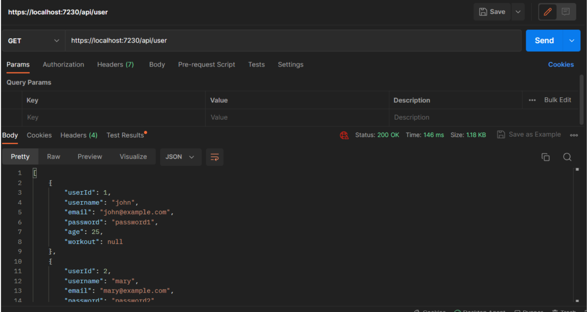
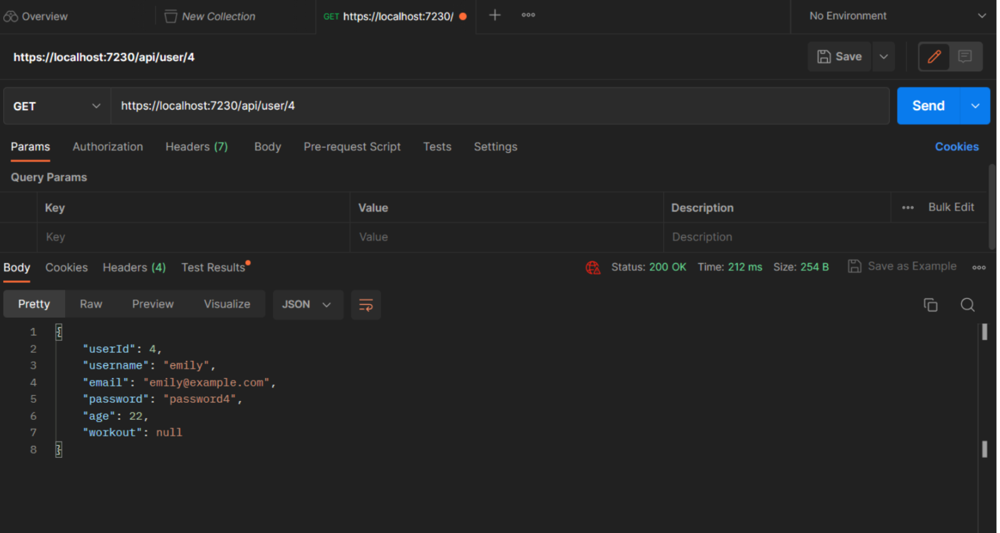
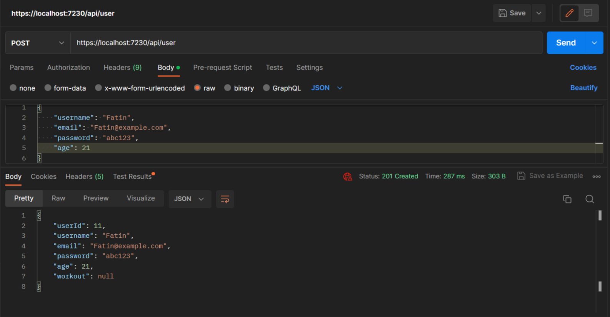
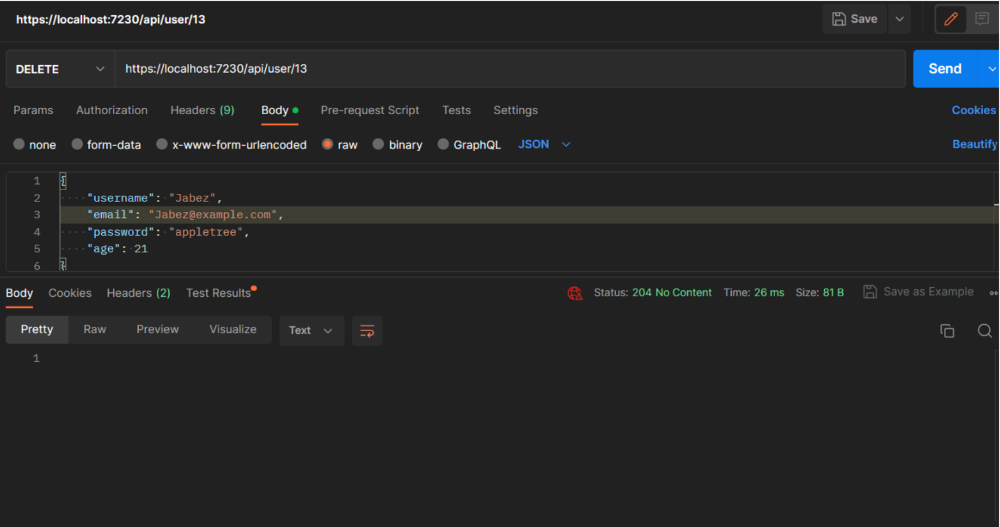

 <h1 align="center">Fitness-Tracking API</h1>

<p align="center">
  
  
</p>

## Description

The Fitness-Tracking API is an Application Programming Interface designed to help users streamline the process of logging their workouts and monitoring their progress over time. This API allows users to integrate data from multiple sources, such as fitness trackers, smartwatches, or manually inputted data, into a singular platform. With this API, users can visualize their progress, set achievable goals, and obtain valuable insights into their workouts.

## Prerequisites

Before using the Fitness-Tracking API, make sure you have the following:
- A basic understanding of Rust programming language
- A MySQL database management system
- A REST client like Postman to test API endpoints

## Installation

To install the Fitness-Tracking API, follow these steps:
1. Clone the repository to your local machine.
2. Open the project in Visual Studio.
3. Build the project to restore the NuGet packages.
4. In Visual Studio's Package Manager Console, deploy it


## Usage
To use the Fitness-Tracking API, you can interact with the following endpoints:

- GET /users - retrieves all users from the database
- POST /users - creates a new user in the database
- GET /users/{id} - retrieves a user by their ID
- PUT /users/{id} - updates a user by their ID
- DELETE /users/{id} - deletes a user by their ID
- GET /workouts - retrieves all workouts from the database
- POST /workouts - creates a new workout in the database
- GET /workouts/{id} - retrieves a workout by its ID
- PUT /workouts/{id} - updates a workout by its ID
- DELETE /workouts/{id} - deletes a workout by its ID

Here is an example of how to create a new user using the Fitness-Tracking API:

Send a POST request to http://localhost:7230/user with the following JSON body:
```rust
{
    "username": "johndoe",
    "email": "johndoe@example.com",
    "password": "password",
    "age": 30
}
```
The API will create a new user in the database and return a response with the user's ID.

## Contributing
If you would like to contribute to the Fitness-Tracking API, please follow these guidelines:

1. Fork the repository and make your changes on a feature branch.

2. Create a new branch for your feature or bug fix
```rust
git checkout -b new-feature
```

3. Submit a pull request with a detailed description of your changes.
```rust
git commit -m "your commit message"
```

4. Push to your branch
```rust
git push origin new-feature
```

5. Create a pull request

Please make sure that your code follows the existing style and that it is thoroughly tested before submitting a pull request.

## License
This project is licensed under the MIT License.

## Contact
If you have any questions or concerns about the Fitness-Tracking API, please contact us at support@fitnesstracker.com.


## Here are some screeenshots on how the post requests should look like:










